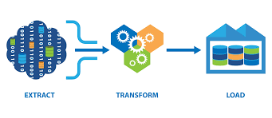

# ETL Pipeline Using Python

# Source System Data
1.	Data Base Tables:
•	Orders
•	Order items
2.	Data-Lake (Directory contains csv files)
•	Brands
•	Categories
•	Customers
•	Products
•	Staffs
•	Stores
•	Stocks
3.	API (get the currency Data from this url https://openexchangerates.org)

# Extraction the data from the prvious source systems
I have created three Jupyter Notebooks:
*	DB: Extract the two tables from SQL-Server
*	DL: Extract the csv files from DL directory
*	API: Extract the currency data from the previous api
Then I write the data from each source systems in a dataframes using pandas then write them into ‘Landing’ Folder, However before write them I added two columns to each dataframe:
•	Extraction Date
•	Source (DB / DL / API)

# Data Quality and Cleansing
After that I created a folder called ‘Quality_Checks’ and I created a seoaraet Jupyter Notebook for each data file inside it to read the data from ‘Landing’ directory then check the data quality and apply the needed data cleansing on them.
Then I write each one of them into a new folder called ‘Staging_1’

# Transformations
I have created a new folder called ‘transformation’ and create four Jupyter Notebooks as the following:
•	Merged the data which coming from API with the data which coming from DB (order_items), then added a calculated column “list_price_egp” which qual (list_price * rate exchange of EGP currency).
•	In orders data (from DB), I added a new column to track the late delivery orders, and added another column to track the holidays (Sunday and Mondey).
•	In customers, I merged customers data with stores (which both coming from Data-Lake) to track if the cities where the customers live has a stores or not ?
•	I create a lookup column that map the order status into four categories (Pending, Processing, Rejected, Completed)
Then I write all the transformed data and not transformed (they don’t need for any transformation) to a new folder called ‘Staging2).

# Modeling
I merged the transformed orders, order items, and products data into one table and saved it in a new directory called ‘Information Mart’.

# Visualization
I create some simple visualizations using matplotlib and seaborn to serve the BI teams and get some insights about these data together.

